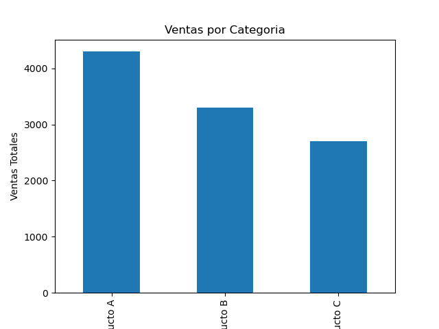

# Ejercicio con Python: Gráfico de Ventas

Este es un ejercicio en Python que genera un gráfico de barras para visualizar las ventas totales por categoría a partir de un archivo de datos en formato Excel.

## Descripción

El script `grafico.py` carga un archivo Excel con datos de ventas, agrupa los datos por categoría y genera un gráfico de barras. El gráfico es luego guardado como una imagen PNG para ser visualizado fácilmente.

Este ejercicio tiene como objetivo aprender a trabajar con bibliotecas de Python como `pandas` para la manipulación de datos y `matplotlib` para la creación de gráficos.

## Tecnologías utilizadas

- **Python**: Lenguaje de programación utilizado para el análisis de datos.
- **pandas**: Biblioteca para el manejo de datos en formato tabular.
- **matplotlib**: Biblioteca para la creación de gráficos.

## Instrucciones de uso

1. Asegúrate de tener Python instalado en tu máquina.
2. Instala las dependencias necesarias:

   ```bash
   pip install pandas matplotlib openpyxl

   

